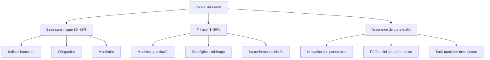

# Résumé des Fonds Captindice I & II (1991-1993)

## 1. Principe de Fonctionnement & Stratégie d'Investissement

Pour plus de détails sur la conception et la performance des premiers fonds, vous pouvez consulter le document Captindice I et II.

document [Captindice I et II](./Captindice_I_et_II.pdf).

Equations Originelles [Captindice I et II](./Equation_Fond_Patriote.pdf).

Presentation du business Fond Indiciel assurés du 16/4/1991  [Captindice I et II](./Fond_Indiciel_1991_red.pdf).

document [Gestion_Dynamique_Passive_1992](./Gestion_Dynamique_Passive_1992.pdf).
 

### Actif du Fonds
-   **Placement Majoritaire (≈97%)** : Certificats de dépôt arrivant à échéance à la même date que le fonds.
-   **Gestion de Trésorerie (1-15%)** : Pris en pension au jour le jour pour couvrir les **appels de marge** des produits dérivés. Le pourcentage varie en fonction des flux de marge.

### Exposition aux Marchés
-   **Instrument** : Contrats à terme (futures) achetés. Ces instruments ne consomment pas de capital.
-   **Impact Financier** : Seuls les **appels de marge** (positifs ou négatifs) ont un impact sur la trésorerie du fonds.

### Algorithme de Gestion de l'Exposition
L'exposition est déterminée dynamiquement par un algorithme basé sur deux facteurs :
1.  **Marge de Sécurité** : L'écart entre la valeur liquidative (+ intérêts à percevoir) et la valeur garantie à l'échéance (capital + cliquets). Cet écart définit le montant "tolérable" à perdre.
2.  **Réaction aux Mouvements de Marché ("Zig-Zags")** :
    -   Le fonds perd de l'exposition s'il subit des pertes ou s'il déclenche un cliquet (prise de bénéfice).
    -   L'exposition peut augmenter si la stratégie de cliquet fonctionne à son avantage.

## 2. Caractéristiques, Avantages et Inconvénients

### Avantages Clés
-   **Garantie du Capital** : Assurance du capital à l'échéance **sans transfert de risque à la banque**. Le risque exceptionnel (scénario de crise extrême) reste porté par les investisseurs.
-   **Produit "d'Attaque"** : Conçu pour être particulièrement agressif et performant durant **les six premiers mois** de sa vie.

### Inconvénients et Défis Identifiés
-   **Dépendance au Timing** : La performance est extrêmement dépendante des conditions de marché au moment du lancement. Il est recommandé de lancer des **séries de fonds** ("en rafale") pour lisser ce risque.
-   **Manque de Transparence** : Le mécanisme de cliquet est indexé sur la performance interne du fonds, et non sur l'indice de marché sous-jacent, ce qui le rend complexe à expliquer.
-   **Dés-exposition Inéluctable** : L'exposition diminue avec le temps et les prises de bénéfice (cliquets) pour garantir le capital à terme, réduisant le potentiel de gain.

## 3. Analyse des Performances : Captindice I vs. Captindice II

| Fond | Date de Lancement | Niveau CAC 40 | Scénario Marché | Résultat | Exposition (au 03/06/93) |
| :--- | :--- | :--- | :--- | :--- | :--- |
| **Captindice I** | Plus tôt | ~1860 | Hausse rapide (+11.6%) puis stagnation | **3 cliquets** déclenchés. Performance positive. | **4.1%** (Très faible) |
| **Captindice II** | ~5 mois après | ~1860 | Baisse rapide (-200 pts), remontée, rechute | **Aucun cliquet**. Subit des pertes. VL < Capital initial. | **14.3%** (Faible) |

**Conclusion de l'analyse** : Captindice II a subi le **scénario le plus défavorable** pour ce type de produit (forte volatilité à la baisse), mettant en évidence son risque principal.

## 4. Leçons et Évolution vers Captindice III

Face aux limites des versions I et II, le fonds **Captindice III** a été conçu avec les améliorations suivantes :

-   **Durée de Vie Étendue** : Passage de **18 à 24 mois** pour libérer un plus grand potentiel de performance et s'adapter à un environnement de taux baissiers.
-   **Garantie Étendue** : La garantie est portée à la **totalité du capital** dans tous les cas (et non plus relative à une valeur calculée).
-   **Meilleure Transparence** : Le mécanisme de cliquet est **indexé directement sur le marché** (e.g., CAC 40) et non sur la performance du fonds, le rendant plus simple à comprendre et à vendre.
-   **Performance Cadrée** : La performance future sera limitée à un cadre prédéfini et annoncé pour chaque tranche émise.

# 📑 Fond “Patriote” (→ Captindice) — Description et équations

## 1. Contexte historique
Le fonds **“Patriote”**, lancé au début des années 1990 et devenu par la suite **“Captindice”**, représentait une innovation majeure :
- Combinaison de **gestion indicielle** (CAC 40) et d’**assurance de portefeuille**.
- Objectif : garantir une **perte maximale en capital** tout en participant aux hausses du marché.
- Outils clés : contrats à terme, mécanisme de **locking/cliquet**, capital protégé.

---

## 2. Équation d’Exposition
$$A_n - (1 + \ell)^{k_n} A_0 + P_n A_0 = e_n b A_n$$

- **Plus-value exposée** : $A_n - (1 + \ell)^{k_n} A_0$
- **Capital exposé** : $P_n A_0$
- **Risque de marché** : $e_n b A_n$

---

## 3. Formation du Capital
$$A_{n+1} - A_n = e_n \left( \frac{M_{n+1} - M_n}{M_n} \right) A_n + r A_n$$

- Variation du capital = exposition au marché + intérêts.
- $e_n$ = exposition dynamique ajustée quotidiennement.

---

## 4. Mécanisme de Locking (Cliquet)
$$k_n = \min \left[ q, \; \text{compteur de locks} \right]$$

- Protège les gains acquis.
- Maximum de $q$ verrouillages possible.

---

## 5. Perte Effective
$$P_n = 1 - \frac{1 - p}{(1 - r)^{E-h}}$$

- Dépend de la **durée réelle d’exposition** $(E-h)$.
- Intègre une **période tampon** $h$ (mise en place & liquidation).
- Garantit la protection dans les phases critiques.

---

## 6. Variables principales
- $A_n$ : actif net au temps $n$
- $M_n$ : cours du contrat future CAC 40
- $e_n$ : exposition théorique quotidienne
- $r$ : taux d’intérêt (≈ 18 mois)
- $\ell$ : niveau de lock (cliquet)
- $k_n$ : compteur de cliquets
- $q$ : nombre max de cliquets
- $b$ : baisse maximale tolérable
- $p$ : perte maximale en capital
- $E$ : durée totale du fonds
- $h$ : période tampon

---

## 6. Schéma simplifié du fonds envisagé

---

✅ **En résumé :**  
Entre 1991 et 1993, la CRD conçoit un fonds indiciel structuré, combinant **gestion passive**, **assurance de portefeuille** et **méthodes quantitatives**.  
La maîtrise du risque (tracking error, pertes maximales, granularité) et l’usage de la technologie sont identifiés comme essentiels pour assurer la viabilité et la crédibilité du projet.

## 7. Reformulation moderne (comparaison avec CPPI/OBPI)

### 7.1. Proche du **CPPI (Constant Proportion Portfolio Insurance)**
- Dans le CPPI, l’allocation suit :
  $$E_t = m \cdot \max(0, A_t - F_t)$$
  où $m$ = multiplicateur, $F_t$ = floor garanti.

- Le **Patriote** a une logique similaire :
  - $A_t$ = capital du fonds.
  - $(1+\ell)^{k_n} A_0$ = *floor ajusté* (lock/cliquet).
  - $e_n$ joue le rôle du multiplicateur d’exposition.

### 7.2. Lien avec **OBPI (Option Based Portfolio Insurance)**
- OBPI = achat d’une option call sur l’indice + placement obligataire.
- Le **Patriote** imite ce mécanisme via :
  - $r A_n$ : partie obligataire.
  - $e_n (M_{n+1}-M_n)/M_n \cdot A_n$ : équivalent de l’exposition optionnelle.
  - $k_n$ : rôle du cliquet, similaire aux *options lookback/cliquet* modernes.

---

## 8. 🔑 Interprétation
- Historiquement, “Patriote” anticipe les mécanismes modernes de **fonds garantis** :
  - Allocation dynamique type **CPPI**,
  - Protection cliquet type **OBPI cliquet**,
  - Ajustement quotidien de l’exposition.

- En 1991, cette approche était **très en avance** : elle combinait mathématiques financières, produits dérivés et structuration d’assurance pour séduire les investisseurs prudents.

---

✅ **Conclusion :**
Le “Patriote” peut être vu comme un **ancêtre hybride** entre **CPPI** et **OBPI**, avec une mécanique propre (cliquets verrouillant la performance).
Ce design a servi de base aux futurs fonds garantis/structurés, et son évolution vers “Captindice” reflète la maturité du marché des années 90.
